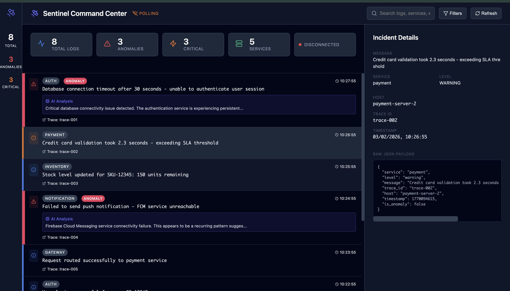
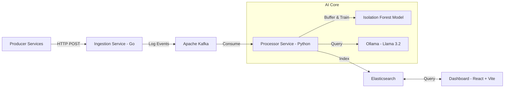

# Sentinel
**Real-time Log Intelligence & Anomaly Detection Platform**

Sentinel is an end-to-end streaming observability platform that ingests logs, detects anomalies in real-time using unsupervised machine learning, and uses LLMs to generate instant Root Cause Analysis (RCA).



---

## Architecture



## Stack

| Component | Tech | Role |
|-----------|------|------|
| Ingestion | Go (Gin) | High-throughput API gateway |
| Messaging | Kafka | Event streaming and backpressure management |
| Processing | Python 3 | Anomaly detection via scikit-learn |
| Intelligence | Ollama (Llama 3.2) | Local LLM inference for RCA |
| Storage | Elasticsearch | Indexed log storage and aggregation |
| UI | React + Vite | Real-time dashboard |

---

## Getting Started

### Prerequisites

- Docker & Docker Compose
- Node.js v18+
- Python 3.9+
- Go 1.21+
- [Ollama](https://ollama.com/) running locally with `llama3.2:1b`

### 1. Start Infrastructure

```bash
docker-compose up -d
```

### 2. Start Services

**Ingestion API**
```bash
cd ingestion-service
go run main.go
```

**AI Processor**
```bash
cd processing-service
python3 -m venv venv
source venv/bin/activate
pip install -r requirements.txt
python processor.py
```

**Dashboard**
```bash
cd dashboard
npm install
npm run dev
```

Visit `http://localhost:5173`

---

## Demo

The repo includes a scenario script that simulates a realistic incident progression:

1. Normal traffic
2. Warning signals — latency spikes, retries
3. Critical anomaly — database failure burst triggering ML detection and LLM RCA

```bash
python3 scripts/demo_script.py
```

---

## Roadmap

- [ ] Prometheus/Grafana integration
- [ ] Chaos engineering layer
- [ ] Distributed tracing with Jaeger
- [ ] Kubernetes migration
