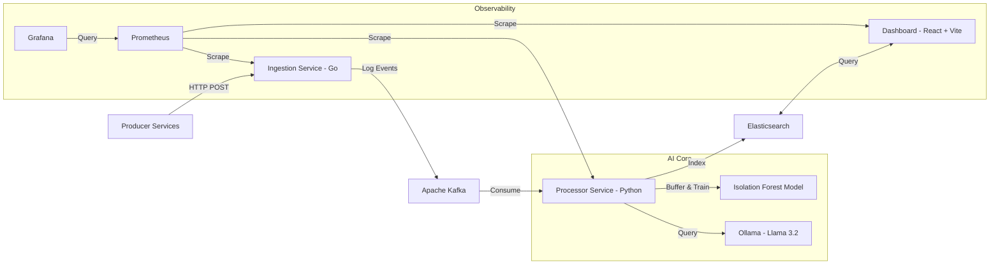

# Sentinel AI
**Real-time Log Intelligence & Anomaly Detection Platform**

Sentinel is an end-to-end streaming observability platform that ingests logs, detects anomalies in real-time using unsupervised machine learning, and uses LLMs to generate instant Root Cause Analysis (RCA).


---

## Architecture


```mermaid
graph LR
    A[Producer Services] -->|HTTP POST| B[Ingestion Service - Go]
    B -->|Log Events| C[Apache Kafka]
    C -->|Consume| D[Processor Service - Python]

    subgraph AI Core
    D -->|Buffer & Train| E[Isolation Forest Model]
    D -->|Query| F[Ollama - Llama 3.2]
    end

    D -->|Index| G[Elasticsearch]
    G <-->|Query| H[Dashboard - React + Vite]

    subgraph Observability
    I[Prometheus] -->|Scrape| B
    I -->|Scrape| D
    I -->|Scrape| H
    J[Grafana] -->|Query| I
    end
```

## Stack

| Component | Tech | Role |
|-----------|------|------|
| Ingestion | Go (Gin) | High-throughput API gateway |
| Messaging | Kafka | Event streaming and backpressure management |
| Processing | Python 3 | Anomaly detection via scikit-learn |
| Intelligence | Ollama (Llama 3.2) | Local LLM inference for RCA |
| Storage | Elasticsearch | Indexed log storage and aggregation |
| UI | React + Vite | Real-time dashboard |
| Monitoring | Prometheus + Grafana | Metrics collection and visualization |

---

## Getting Started

### Prerequisites

- Docker & Docker Compose
- Node.js v18+
- Python 3.9+
- Go 1.21+
- [Ollama](https://ollama.com/) running locally with `llama3.2:1b`

### Quick Start (Docker Compose)

```bash
# Start all services (infrastructure + application)
docker-compose up -d

# Pull the Ollama model (first time only)
docker exec -it sentinel-ai-ollama-1 ollama pull llama3.2:1b
```

Visit:
- **Dashboard**: http://localhost:3001
- **Grafana**: http://localhost:3000 (admin/admin)
- **Prometheus**: http://localhost:9090
- **Ingestion API**: http://localhost:8080

### Manual Development Setup

**Ingestion API**
```bash
cd ingestion-service
go run main.go
```

**AI Processor**
```bash
cd processing-service
python3 -m venv venv
source venv/bin/activate
pip install -r requirements.txt
python processor.py
```

**Dashboard**
```bash
cd dashboard
npm install
npm run dev
```

---

## Production Deployment

### Docker Compose

The simplest deployment option. All services are defined in `docker-compose.yml`:

```bash
docker-compose up -d
```

### Kubernetes (Minikube / Local)

```bash
# Build images locally
docker build -t sentinel/ingestion-service:latest ./ingestion-service
docker build -t sentinel/processing-service:latest ./processing-service
docker build -t sentinel/dashboard:latest ./dashboard

# Deploy all manifests
kubectl apply -k k8s/

# Watch pods come up
kubectl -n sentinel get pods -w
```

### AWS EKS

See [aws/README.md](aws/README.md) for the complete EKS deployment guide:

1. Create cluster: `eksctl create cluster -f aws/eksctl-cluster.yml`
2. Install ALB Controller via Helm
3. Push images to ECR: `./aws/push-to-ecr.sh`
4. Update image URIs in K8s manifests
5. Deploy: `kubectl apply -k k8s/`

---

## Monitoring

### Prometheus Metrics

All services expose Prometheus metrics:

| Service | Port | Path | Metrics |
|---------|------|------|---------|
| Ingestion | 8080 | `/metrics` | `logs_ingested_total`, `ingestion_duration_seconds` |
| Processing | 8001 | `/metrics` | `logs_processed_total`, `anomalies_detected_total`, `processing_duration_seconds`, `es_write_errors_total` |
| Dashboard | 3001 | `/metrics` | Express default metrics |

### Grafana Dashboard

A pre-provisioned Grafana dashboard ("Sentinel AI Overview") includes:
- **Log Ingestion Rate** — `rate(logs_ingested_total[5m])`
- **Total Anomalies** — `anomalies_detected_total`
- **Latency p95** — ingestion and processing histograms
- **ES Write Errors** — `rate(es_write_errors_total[5m])`
- **Logs Processed Rate** — `rate(logs_processed_total[5m])`

Access Grafana at http://localhost:3000 (Docker Compose) or via Ingress `/grafana` (K8s).

---

## Testing

### Run All Tests

```bash
# Go (Ingestion Service)
cd ingestion-service && go test -v -race ./...

# Python (Processing Service)
cd processing-service
pip install pytest
pytest test_processor.py -v

# Node.js (Dashboard)
cd dashboard && npm test

# Integration (K8s Manifests & Dockerfiles)
pip install pytest pyyaml
pytest tests/integration/ -v
```

### CI/CD

GitHub Actions runs all tests on push/PR to `main`:
- Go tests with race detection
- Python unit tests
- Node.js/Vitest tests
- K8s manifest validation
- Docker image builds (no push)

---

## Demo

The repo includes a scenario script that simulates a realistic incident progression:

1. Normal traffic
2. Warning signals — latency spikes, retries
3. Critical anomaly — database failure burst triggering ML detection and LLM RCA

```bash
python3 scripts/demo_script.py
```

---

## Project Structure

```
sentinel-ai/
├── ingestion-service/       # Go HTTP API → Kafka
│   ├── main.go
│   ├── main_test.go
│   └── Dockerfile
├── processing-service/      # Python Kafka consumer → AI → ES
│   ├── processor.py
│   ├── test_processor.py
│   └── Dockerfile
├── dashboard/               # React + Vite + Express
│   ├── server.js
│   ├── server.test.js
│   └── Dockerfile
├── k8s/                     # Kubernetes manifests
│   ├── 00-namespace.yml
│   ├── 01-zookeeper.yml
│   ├── ...
│   └── kustomization.yml
├── aws/                     # AWS EKS deployment
│   ├── eksctl-cluster.yml
│   ├── push-to-ecr.sh
│   └── README.md
├── monitoring/              # Prometheus & Grafana configs
│   ├── prometheus.yml
│   └── grafana/provisioning/
├── .github/workflows/       # CI/CD
│   └── ci.yml
├── docker-compose.yml
└── README.md
```

---

## Roadmap

- [x] Prometheus/Grafana integration
- [x] Kubernetes migration
- [ ] Chaos engineering layer
- [ ] Distributed tracing with Jaeger
- [ ] Multi-tenant log isolation
- [ ] AWS Bedrock integration (replace Ollama)
