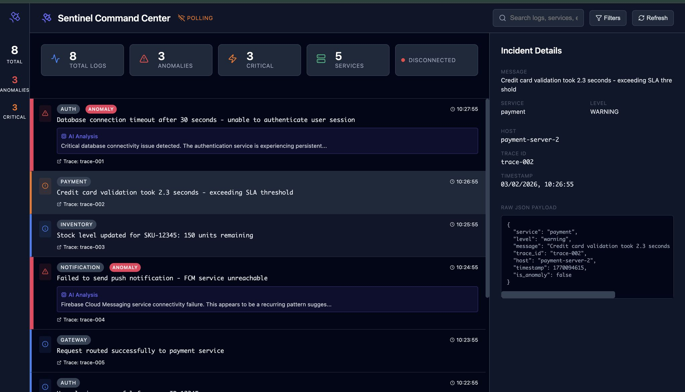
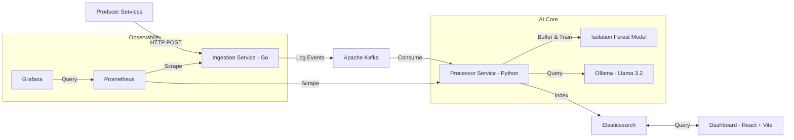

# 🛰️ Sentinel AI

**Open-source real-time anomaly detection and AI-powered root cause analysis for modern observability.**

[](LICENSE)
[](https://github.com/Uday9909/Sentinel-Ai/stargazers)
[](https://github.com/Uday9909/Sentinel-Ai/actions)
[](https://go.dev/)
[](https://python.org/)

Sentinel ingests logs, detects anomalies in real-time using unsupervised machine learning (Isolation Forest), and generates instant Root Cause Analysis (RCA) via local LLM inference (Ollama).



---

## Why Sentinel?

Most observability platforms are expensive, cloud-locked, and opaque. Sentinel is different:

- **🔒 Local LLM, no data leaks** — RCA runs on your machine via Ollama. No logs leave your network. No per-token API costs.
- **☁️ No vendor lock-in** — No Datadog, no New Relic, no Grafana Cloud dependency. Everything runs on Docker Compose on your own hardware.
- **⚡ Kafka-native streaming** — Real-time ingestion through Kafka means backpressure, replay, and partitioning come free. Your pipeline doesn't drop logs under load.

---

## Architecture

Sentinel is built as a streaming pipeline with four main stages: ingestion, messaging, AI processing, and visualization.


```mermaid
graph LR
    A[Producer Services] -->|HTTP POST| B[Ingestion Service - Go]
    B -->|Log Events| C[Apache Kafka]
    C -->|Consume| D[Processor Service - Python]

    subgraph AI Core
    D -->|Buffer & Train| E[Isolation Forest Model]
    D -->|Query| F[Ollama - Llama 3.2]
    end

    D -->|Index| G[Elasticsearch]
    G <-->|Query| H[Dashboard - React + Vite]

    subgraph Observability
    I[Prometheus] -->|Scrape| B
    I -->|Scrape| D
    J[Grafana] -->|Query| I
    end
```

*Pipeline flow: Producer services send logs to the Go ingestion API, which publishes them to Kafka. The Python processor consumes the stream, trains an Isolation Forest model for anomaly detection, and queries Ollama for RCA on anomalies. Results are indexed in Elasticsearch and surfaced in the React dashboard. Prometheus scrapes metrics from both the ingestion and processing services, visualized in Grafana.*

## Stack

| Component | Tech | Responsibility |
|-----------|------|----------------|
| **Ingestion** | Go (Gin) | HTTP API → Kafka (`:8080`) |
| **Processor** | Python 3 | Drain3 + Isolation Forest + LLM → ES |
| **Dashboard** | React + Vite | Real-time log feed (`:5173` dev) |
| **Intelligence** | Ollama (Llama 3.2) | Local LLM for root cause analysis |
| **Storage** | Elasticsearch | Indexed log storage and search |
| **Monitoring** | Prometheus + Grafana | Metrics collection and visualization |
| **Streaming** | Apache Kafka | Event buffering, backpressure, and replay |

---

## Quick Start

### Docker Compose (single host)

```bash
docker compose up -d

# Pull the Ollama model (first time only)
docker exec -it sentinel-ai-ollama-1 ollama pull llama3.2:1b
```

| Service | URL |
|---------|-----|
| Dashboard | http://localhost:3001 |
| Grafana | http://localhost:3000 |
| Prometheus | http://localhost:9090 |
| Ingestion API | http://localhost:8080 |

### Development (without Docker)

```bash
# 1. Start infrastructure
docker-compose up -d

# 2. Ingestion API
cd ingestion-service && go run main.go

# 3. AI Processor
cd processing-service
python3 -m venv venv && source venv/bin/activate
pip install -r requirements.txt && python processor.py

# 4. Dashboard
cd dashboard && npm install && npm run dev
```

> **Prerequisites**: Go 1.25+, Python 3.11+, Node.js 22+, Ollama with `llama3.2:1b`.

---

## Testing

```bash
# Go
cd ingestion-service && go test -v -race ./...

# Python
cd processing-service && pip install pytest && pytest -v

# All checks via Makefile
make test
```

CI runs all checks on every push via GitHub Actions.

---

## Deployment

### Kubernetes

```bash
docker build -t sentinel/ingestion-service:latest ./ingestion-service
docker build -t sentinel/processing-service:latest ./processing-service
docker build -t sentinel/dashboard:latest ./dashboard
kubectl apply -k k8s/
```

### AWS EKS

See [aws/README.md](aws/README.md) — EKS cluster with ECR, ALB ingress.

---

## Demo

Simulates an incident progression (normal → warnings → critical burst):

```bash
python3 scripts/demo_script.py
```

## Project Structure

```
├── ingestion-service/       Go HTTP API → Kafka
├── processing-service/      Python processor → anomaly detection → ES
├── dashboard/               React + Vite + Express proxy
├── monitoring/              Prometheus & Grafana configs
├── k8s/                     Kubernetes manifests (Kustomize)
├── aws/                     AWS EKS deployment configs
├── .github/workflows/       CI/CD (GitHub Actions)
├── scripts/                 Demo & verification scripts
└── docker-compose.yml       Full-stack orchestration
```

---

## Progress

- [x] Core pipeline (ingestion → Kafka → ML → ES → dashboard)
- [x] Prometheus/Grafana integration
- [x] Kubernetes manifests (Kustomize)
- [x] AWS EKS deployment
- [x] CI/CD (GitHub Actions, GHCR)
- [x] Graceful shutdown (all services)
- [ ] Chaos engineering layer
- [ ] Distributed tracing (Jaeger)
- [ ] Multi-tenant log isolation
- [ ] AWS Bedrock (alternative to Ollama)

---

## 🤝 Contributing

We welcome contributions! See [CONTRIBUTING.md](CONTRIBUTING.md) for development setup, coding standards, the PR process, and good first issues. Check out [GOOD_FIRST_ISSUES.md](GOOD_FIRST_ISSUES.md) for starter-friendly tasks.

---

## 📋 Changelog

[](./CHANGELOG.md)

See [CHANGELOG.md](./CHANGELOG.md) for a detailed history of changes and releases.

---

## 📄 License

This project is licensed under the MIT License — see the [LICENSE](LICENSE) file for details.

---

*Built with Go, Python, Kafka, Elasticsearch, Ollama, and React.*
