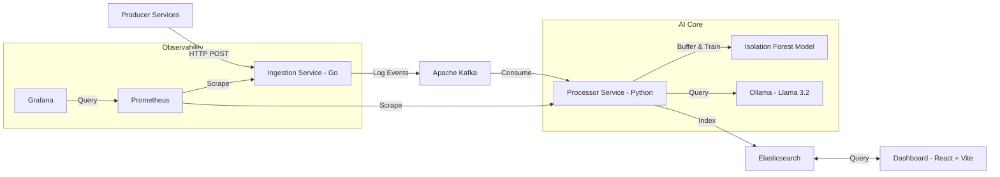

# Sentinel AI

**Real-time Log Intelligence & Anomaly Detection Platform**

Sentinel ingests logs, detects anomalies in real-time using unsupervised machine learning, and generates instant Root Cause Analysis (RCA) via local LLM inference.


---

## Architecture


```mermaid
graph LR
    A[Producer Services] -->|HTTP POST| B[Ingestion Service - Go]
    B -->|Log Events| C[Apache Kafka]
    C -->|Consume| D[Processor Service - Python]

    subgraph AI Core
    D -->|Buffer & Train| E[Isolation Forest Model]
    D -->|Query| F[Ollama - Llama 3.2]
    end

    D -->|Index| G[Elasticsearch]
    G <-->|Query| H[Dashboard - React + Vite]

    subgraph Observability
    I[Prometheus] -->|Scrape| B
    I -->|Scrape| D
    J[Grafana] -->|Query| I
    end
```

## Stack

| Component   | Language          | Role                             |
|-------------|-------------------|----------------------------------|
| Ingestion   | Go (Gin)          | HTTP API → Kafka (`:8080`)       |
| Processor   | Python 3          | Drain3 + IsolationForest + LLM → ES |
| Dashboard   | React + Vite      | Real-time log feed (`:5173` dev) |
| API Server  | Node/Express      | Backend proxy to ES (`:3001`)    |
| Intelligence| Ollama Llama 3.2  | Local LLM for root cause analysis|
| Storage     | Elasticsearch     | Indexed log storage              |
| Monitoring  | Prometheus + Grafana | Metrics & visualization        |
| Streaming   | Apache Kafka      | Event buffering & backpressure   |

## Quick Start

```bash
docker compose up -d

# Pull the Ollama model (first time only)
docker exec -it sentinel-ai-ollama-1 ollama pull llama3.2:1b
```

| Service           | URL                       |
|-------------------|---------------------------|
| Dashboard         | http://localhost:3001      |
| Grafana           | http://localhost:3000      |
| Prometheus        | http://localhost:9090      |
| Ingestion API     | http://localhost:8080      |

### Development (without Docker)

```bash
# Ingestion
cd ingestion-service && go run main.go

# Processor
cd processing-service
python3 -m venv venv && source venv/bin/activate
pip install -r requirements.txt && python processor.py

# Dashboard
cd dashboard && npm install && npm run dev
```

## Testing

```bash
# Go (8 tests)
cd ingestion-service && go test -v -race ./...

# Python (20 tests)
cd processing-service && pip install pytest && pytest -v

# Dashboard (20 tests)
cd dashboard && npm test

# Integration — K8s manifests, Dockerfile validation
pip install pytest pyyaml && pytest tests/integration/ -v
```

CI runs all tests on every push via GitHub Actions.

## Deployment

### Docker Compose (single host)

```bash
docker compose up -d
```

### Kubernetes

```bash
docker build -t sentinel/ingestion-service:latest ./ingestion-service
docker build -t sentinel/processing-service:latest ./processing-service
docker build -t sentinel/dashboard:latest ./dashboard
kubectl apply -k k8s/
```

### AWS EKS

See [aws/README.md](aws/README.md) — EKS cluster with ECR, ALB ingress.

## Demo

Simulates an incident progression (normal → warnings → critical burst):

```bash
python3 scripts/demo_script.py
```

## Project Structure

```
├── ingestion-service/       Go HTTP API → Kafka
├── processing-service/      Python processor → anomaly detection → ES
├── dashboard/               React + Vite + Express proxy
├── monitoring/              Prometheus & Grafana configs
├── k8s/                     Kubernetes manifests (Kustomize)
├── aws/                     AWS EKS deployment configs
├── .github/workflows/       CI/CD (GitHub Actions)
├── scripts/                 Demo & verification scripts
├── tests/                   Integration tests
└── docker-compose.yml       Full-stack orchestration
```

## Progress

- [x] Prometheus/Grafana integration
- [x] Kubernetes manifests (Kustomize)
- [x] AWS EKS deployment
- [x] CI/CD (GitHub Actions, GHCR)
- [x] Graceful shutdown (all services)
- [ ] Chaos engineering layer
- [ ] Distributed tracing (Jaeger)
- [ ] Multi-tenant log isolation
- [ ] AWS Bedrock (alternative to Ollama)
